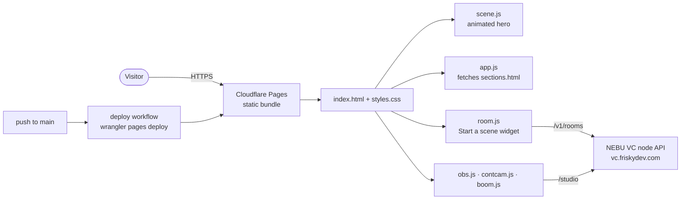

<p align="center">
  
</p>

<h1 align="center">NEBU.QUEST</h1>

<p align="center"><b>Living landing MVP for NEBU. Animated scene hero, brand sections and an honest live-room widget. Static, no build.</b></p>

<p align="center">
  <a href="https://github.com/FriskyDevelopments/nebu-quest/actions/workflows/deploy.yml"></a>
  
  
  
</p>

NEBU.QUEST is the marketing and live-proof landing page for NEBU. It is plain HTML, CSS and vanilla JavaScript: an animated scene hero, brand sections loaded from `sections.html`, and a "Start a scene" room widget that talks to the NEBU VC node API (`https://vc.friskydev.com`). It also includes helpers for OBS ("On air / Add to OBS"), Continuity Camera and Boom. There is no framework, bundler or server. It is for the NEBU team and anyone reviewing or deploying the landing page.

## Architecture



## Stack

- Static HTML, CSS and vanilla JavaScript (no build step)
- Cloudflare Pages (`_headers` for security/caching headers), deployed with `cloudflare/wrangler-action`
- `verify.sh`: local static server + headless Chrome screenshots and asset/markup checks

## Project structure

```text
index.html        # page shell, meta/og tags, hero + room widget mount points
sections.html     # brand sections fragment (loaded by app.js)
styles.css        # all styles
scene.js          # animated scene hero
app.js            # sections + interactivity
room.js           # "Start a scene" room widget (VC node API)
obs.js            # On air / Add to OBS
contcam.js        # Continuity Camera support
boom.js           # Boom support
assets/           # NEBU icon, marks, wordmark, social image, studio preview
brand/            # NEBU brandbook (PDF)
_headers          # Cloudflare Pages headers
verify.sh         # verification rig
SPEC.md DEPLOY.md RELEASE-v1.md
```

## Local development

```bash
# Serve the folder locally (any static server works)
python3 -m http.server 8000

# Run the verification rig (static server + headless Chrome checks)
./verify.sh
```

## Deploy

Every push to `main` runs [`.github/workflows/deploy.yml`](.github/workflows/deploy.yml), which uploads the repository root to the Cloudflare Pages project **`nebu-quest`** with `wrangler pages deploy`. There are no environment variables. The workflow uses Cloudflare credentials stored as GitHub Actions secrets.

Pointing the `nebu.quest` custom domain at this bundle is a separate, owner-approved cutover. Follow the checklist and rollback plan in [DEPLOY.md](DEPLOY.md).

## Docs

- [SPEC.md](SPEC.md): architectural spec for the MVP
- [DEPLOY.md](DEPLOY.md): cutover checklist, publish and rollback
- [RELEASE-v1.md](RELEASE-v1.md): release notes
- [brand/NEBU-Brandbook.pdf](brand/NEBU-Brandbook.pdf): brandbook
