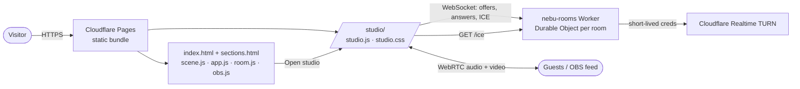

<p align="center">
  
</p>

<h1 align="center">NEBU.QUEST</h1>

<p align="center"><b>NEBU: a working browser studio plus its landing page. Scenes, a live audio mix, rooms and recording, all in the browser. Static, no build.</b></p>

<p align="center">
  <a href="https://github.com/FriskyDevelopments/nebu-quest/actions/workflows/deploy.yml"></a>
  
  
  
</p>

NEBU.QUEST is NEBU's home on the web and the studio itself. The landing page (plain HTML, CSS and vanilla JavaScript) sells it; `/studio/` is the actual in-browser studio every "Open studio" button opens. No framework, no bundler, no account.

## What the studio does

| Promise on the page | How it works |
| --- | --- |
| Camera, screen and video | `getUserMedia` with camera and mic pickers (Boom, Continuity Camera and virtual cameras show up like any camera), `getDisplayMedia` for a screen, window or tab (with tab audio), and a local video file. |
| Set the scene | Canvas compositor at 1280×720/30: Camera, Screen, Screen + cam, Side by side and Room grid layouts, plus a lower third. |
| Balance your audio | Web Audio channel strips for Mic, Screen, Video and Room: fader, mute, "hear" (monitor) and live level meters, plus a master strip. |
| Record | `MediaRecorder` on the program output and the full mix, saved to your device as WebM (MP4 in Safari). Nothing is uploaded. |
| Bring people in | Rooms over WebRTC (mesh, up to 4 people). Signaling runs on a small Cloudflare Worker with one Durable Object per room (`worker/`). Media goes browser to browser, with Cloudflare Realtime TURN as a relay when a network blocks a direct path. Invite link, Share, `.ics` calendar file. |
| Add to OBS | Every room has a receive-only clean feed: `/studio/?room=<id>&view=clean`, loaded as an OBS Browser Source. |

## Architecture


```mermaid
flowchart LR
  visitor([Visitor]) -->|HTTPS| pages[Cloudflare Pages<br/>static bundle]
  pages --> landing[index.html + sections.html<br/>scene.js · app.js · room.js · obs.js]
  pages --> studio[/studio/<br/>studio.js · studio.css/]
  landing -->|Open studio| studio
  studio -->|WebSocket: offers, answers, ICE| sig[nebu-rooms Worker<br/>Durable Object per room]
  studio -->|GET /ice| sig
  sig -->|short-lived creds| turn[Cloudflare Realtime TURN]
  studio <-->|WebRTC audio + video| peer([Guests / OBS feed])
```

## Project structure

```text
index.html        # landing shell, meta/og tags, hero + room band
sections.html     # landing sections fragment (loaded by app.js)
styles.css        # landing styles
scene.js          # animated scene hero
app.js            # sections + interactivity; studio links -> /studio/
room.js           # "Open a room" widget (checks the room service, issues a studio room link)
obs.js            # copies the OBS Browser Source checklist
contcam.js boom.js# Continuity Camera / Boom checklists
studio/           # the studio: index.html, studio.css, studio.js
worker/           # nebu-rooms signaling Worker (Durable Objects) + wrangler.toml
tests/            # e2e.mjs (fake devices, 2-browser room, recording) and shots.mjs
scripts/stage.sh  # copies the publishable files into dist/ for Pages
assets/ brand/    # NEBU icon, marks, wordmark, social image, studio shot; brandbook
_headers          # Cloudflare Pages headers
verify.sh         # quick static checks + screenshots
```

## Local development

```bash
# Serve the folder locally (any static server works)
python3 -m http.server 8000

# Run the verification rig (static server + headless Chrome checks)
./verify.sh

# Full studio test with fake camera/mic/screen (needs `npm i playwright`)
BASE=http://127.0.0.1:8000 node tests/e2e.mjs

# Signaling Worker locally
cd worker && npm i && npx wrangler dev
```

Camera, mic and screen need a secure context: `localhost` works, a LAN IP over plain http does not.

## Deploy

- Site: `./scripts/stage.sh` then `wrangler pages deploy dist --project-name nebu-quest` (add `--branch <name>` for a preview, `--branch main` for production). The GitHub workflow does the production deploy on push to `main` once the `CLOUDFLARE_API_TOKEN` and `CLOUDFLARE_ACCOUNT_ID` Actions secrets exist (they do not yet, so those runs fail).
- Rooms: `cd worker && npx wrangler deploy` (Worker `nebu-rooms` on workers.dev). TURN is optional: set `TURN_KEY_ID` and `TURN_KEY_API_TOKEN` with `wrangler secret put`.

See [DEPLOY.md](DEPLOY.md) for preview, promotion and rollback.

## Docs

- [SPEC.md](SPEC.md): architectural spec for the MVP
- [DEPLOY.md](DEPLOY.md): cutover checklist, publish and rollback
- [RELEASE-v1.md](RELEASE-v1.md): release notes
- [brand/NEBU-Brandbook.pdf](brand/NEBU-Brandbook.pdf): brandbook
